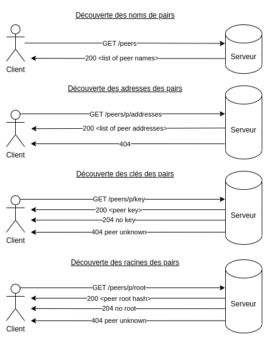
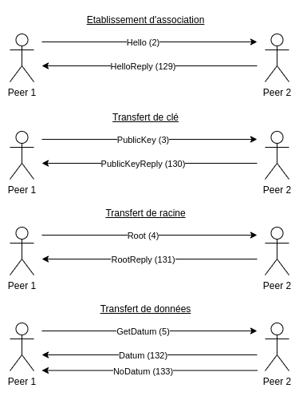

# Protocoles Internet 2023

[Sujet du projet](res/projet.pdf)

## Protocole client-serveur

Protocole de type REST (donc basé sur HTTP, ici sécurisé par TLS)

Le serveur REST sert à l'identification des pairs.

Depuis le serveur REST, il est possible d'obtenir:
- La liste des noms de pairs enregistrés
- L'adresse de sockets UDP de ces mêmes pairs
- Les clés cryptographiques publiques des pairs
- Le hash de la racine de chaque pair

### Les requêtes

Sur le diagramme un texte entre chevrons (< exemple >) correspond à une description du contenu du corps de la réponse.
Dans le cas d'une liste, REST spécifie un élément par ligne.

Dans les requêtes sur un URL de la forme `/peers/p/...`, le `p` correspond au nom du pair tel qu'il a été renvoyé par le serveur.



## Protocole pair-à-pair

Protocole basé sur UDP.

Le protocole sert à l'échange des données.

### Les requêtes

#### Tous les messages ont le format suivant seule la composition du corps change:
```
 0                   1                     2                 3
 0 1 2 3 4 5 6 7 8 9 0 1 2 3 4 5 6 7 8 9 0 1 2 3 4 5 6 7 8 9 0 1
+-+-+-+-+-+-+-+-+-+-+-+-+-+-+-+-+-+-+-+-+-+-+-+-+-+-+-+-+-+-+-+-+
|                               Id                              |
+-+-+-+-+-+-+-+-+-+-+-+-+-+-+-+-+-+-+-+-+-+-+-+-+-+-+-+-+-+-+-+-+
|      Type     |           Length              |       Body...
+-+-+-+-+-+-+-+-+-+-+-+-+-+-+-+-+-+-+-+-+-+-+-+-+-+-+-+-+-+-
|   Signature...
+-+-+-+-+-+-+-+-+-+-
```

#### Cas particuliers de Hello et HelloReply:
```
 0                   1                     2                 3
 0 1 2 3 4 5 6 7 8 9 0 1 2 3 4 5 6 7 8 9 0 1 2 3 4 5 6 7 8 9 0 1
+-+-+-+-+-+-+-+-+-+-+-+-+-+-+-+-+-+-+-+-+-+-+-+-+-+-+-+-+-+-+-+-+
|                               Id                              |
+-+-+-+-+-+-+-+-+-+-+-+-+-+-+-+-+-+-+-+-+-+-+-+-+-+-+-+-+-+-+-+-+
|      Type     |           Length              |  Extensions...
+-+-+-+-+-+-+-+-+-+-+-+-+-+-+-+-+-+-+-+-+-+-+-+-+-+-+-+-+-+-+-+-+
|           Extensions (cont'd)                 |   Name...
+-+-+-+-+-+-+-+-+-+-+-+-+-+-+-+-+-+-+-+-+-+-+-+-+-+-+-+-+-+-+-+-+
|   Signature...
+-+-+-+-+-+-+-+-+-+-
```
Le champ extension est de longueur 4 octets.

Le champ name est de longueur `Length - 4` octets.

Le champ signature optionnel est de longueur 64 octets.

#### Cas particuliers de GetDatum et Datum:
```
 0                   1                     2                 3
 0 1 2 3 4 5 6 7 8 9 0 1 2 3 4 5 6 7 8 9 0 1 2 3 4 5 6 7 8 9 0 1
+-+-+-+-+-+-+-+-+-+-+-+-+-+-+-+-+-+-+-+-+-+-+-+-+-+-+-+-+-+-+-+-+
|                               Id                              |
+-+-+-+-+-+-+-+-+-+-+-+-+-+-+-+-+-+-+-+-+-+-+-+-+-+-+-+-+-+-+-+-+
|      Type     |           Length              |   Hash...
+-+-+-+-+-+-+-+-+-+-+-+-+-+-+-+-+-+-+-+-+-+-+-+-+-+-+-+-+-+-+-+-+     
|                           Value...
+-+-+-+-+-+-+-+-+-+-+-+-+-+-+-+-+-+-+-+-+-+-+-+-+-+-+-+-+-+-+-+-+
|   Signature...
+-+-+-+-+-+-+-+-+-+-
```
Le champ hash est de longueur 32 octets.

Le champ value est de longueur `Length - 32` octets.

Le champ signature optionnel est de longueur 64 octets.

Sur le diagramme un numéro entre parenthèses spécifie le numéro correspondant au type du message.
